# GuidePath AI - Professional Architecture & Implementation Guide

This document outlines the comprehensive architecture and implementation specifications for the GuidePath AI medical treatment navigation platform, based on the production system at https://www.guidedpath.app/.

## Table of Contents

1. [System Architecture Overview](#1-system-architecture-overview)
2. [Component Architecture Diagram](#2-component-architecture-diagram)
3. [Data Flow Architecture](#3-data-flow-architecture)
4. [User Workflow Sequence](#4-user-workflow-sequence)
5. [Database Schema Architecture](#5-database-schema-architecture)
6. [Authentication & Security Flow](#6-authentication--security-flow)
7. [Clinical Trial Matching Engine](#7-clinical-trial-matching-engine)
8. [Deployment & CI/CD Pipeline](#8-deployment--cicd-pipeline)
9. [Implementation Roadmap](#9-implementation-roadmap)

---

## 1. System Architecture Overview

```mermaid
graph TB
    subgraph Frontend
        A[React + TypeScript App]
        B[React Flow Visualization]
        C[Zustand State Management]
        D[Tailwind CSS Styling]
    end

    subgraph Backend Services
        E[Supabase Backend]
        F[PostgreSQL Database]
        G[Authentication Service]
        H[Serverless Functions]
    end

    subgraph External APIs
        I[ClinicalTrials.gov API]
        J[ASCO/EULAR Guidelines API]
        K[Pharmacy Integration API]
        L[Insurance Providers API]
    end

    subgraph Hosting & Infrastructure
        M[Vercel Platform]
        N[CDN & Edge Network]
        O[Serverless Runtime]
    end

    A --> B
    A --> C
    A --> D
    A --> E
    E --> F
    E --> G
    E --> H
    H --> I
    H --> J
    H --> K
    H --> L
    M --> N
    M --> O
    A --> M

    style A fill:#61dafb
    style E fill:#3ecf8e
    style M fill:#000000
    style I fill:#ff6b6b
```

## 2. Component Architecture Diagram

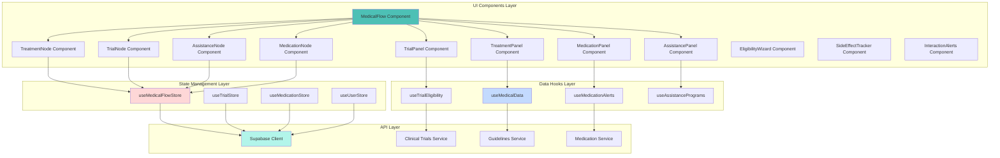

## 3. Data Flow Architecture

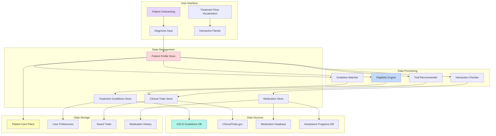

## 4. User Workflow Sequence

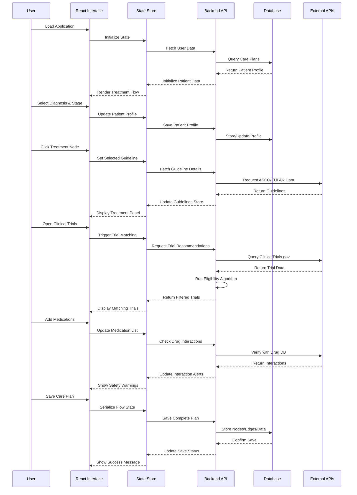

## 5. Database Schema Architecture

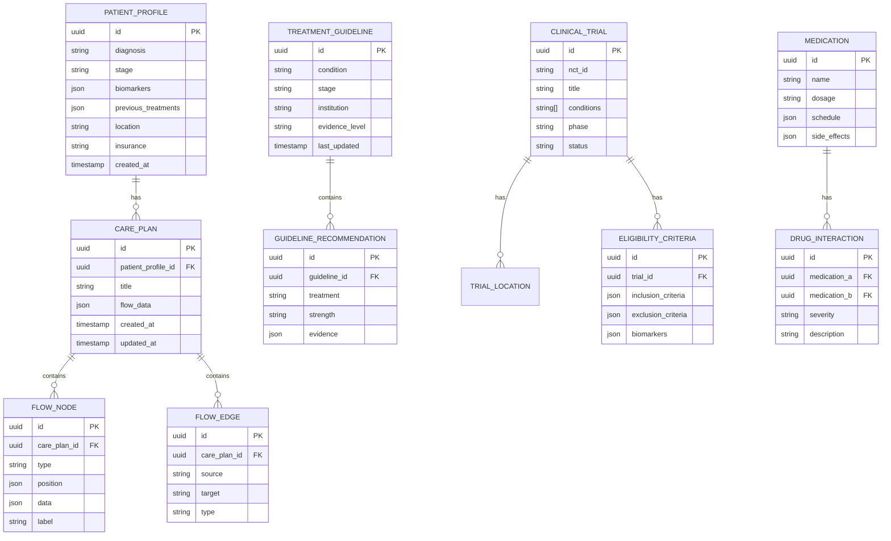

## 6. Authentication & Security Flow

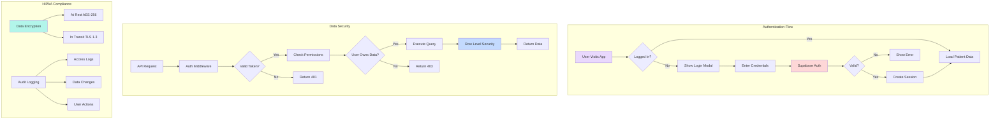

## 7. Clinical Trial Matching Engine

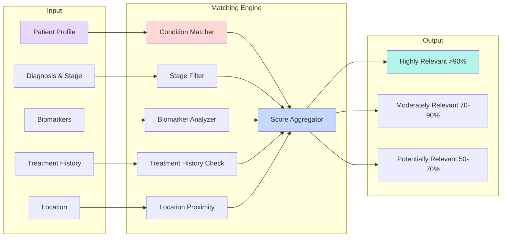

## 8. Deployment & CI/CD Pipeline

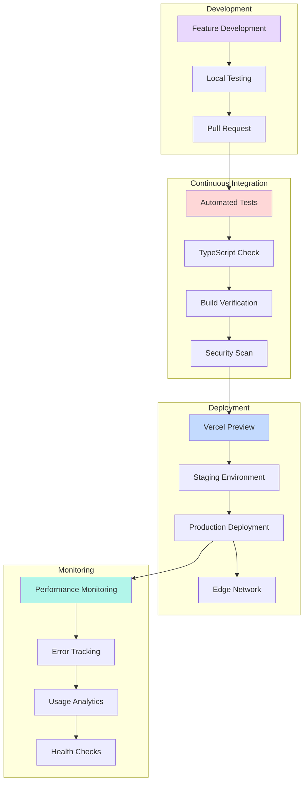

## 9. AI/ML Architecture & RAG System

This section outlines the comprehensive AI/ML implementation including RAG (Retrieval-Augmented Generation), LLM model integration, and vector database systems.

### **RAG (Retrieval-Augmented Generation) Architecture**

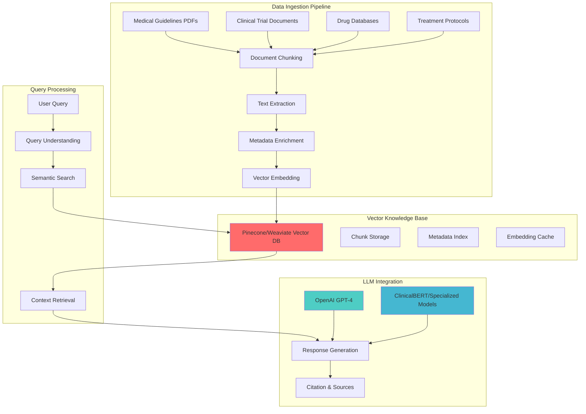

### **LLM Models Implementation**

#### **1. Primary Foundation Models**
- **GPT-4 (OpenAI)** - Primary reasoning and generation for complex medical queries
- **GPT-3.5-Turbo** - Fast responses for simpler queries and conversational interfaces
- **Claude-2/3 (Anthropic)** - Alternative model for complex medical reasoning and safety

#### **2. Specialized Medical LLMs**
- **ClinicalBERT** - Medical text understanding and entity recognition
- **BioBERT** - Biomedical literature processing and research comprehension
- **PubMedBERT** - Medical research papers and clinical study analysis
- **Custom fine-tuned models** - Domain-specific models trained on medical guidelines

#### **3. Embedding Models**
- **text-embedding-ada-002** - General text embeddings for semantic search
- **sentence-transformers/all-mpnet-base-v2** - Dense retrieval for medical documents
- **Specialized medical embeddings** - Custom embeddings for clinical text processing

#### **4. Supporting Models**
- **Intent Classification Model** - Query type and complexity assessment
- **Query Understanding Model** - Medical entity extraction and context analysis
- **Response Quality Scoring** - Medical accuracy and completeness evaluation

### **Multi-Model Routing System**

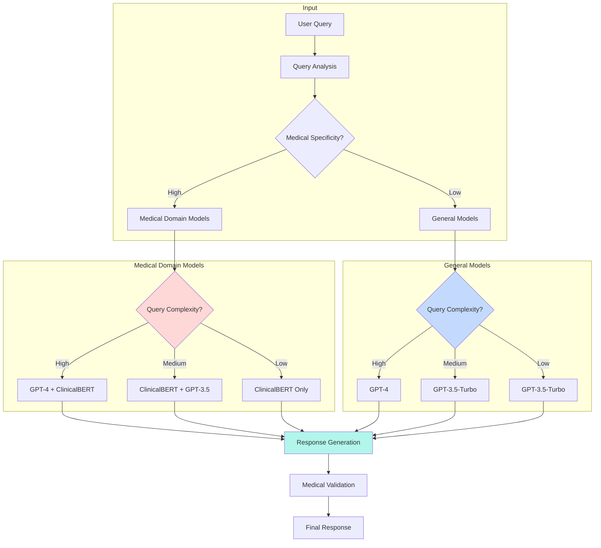

### **Document Processing Pipeline**

```python
# Medical Document Processing Implementation
class MedicalRAGPipeline:
    def process_medical_documents(self, documents: List[MedicalDocument]):
        """Process medical documents for RAG system"""

        # Medical-aware text splitting
        chunks = self.medical_text_splitter(
            documents,
            chunk_size=1000,
            chunk_overlap=200,
            separators=["## Treatment", "## Recommendation", "\n\n", "."]
        )

        # Enrich with medical metadata
        enriched_chunks = self.add_medical_metadata(chunks, {
            'evidence_level': ['High', 'Moderate', 'Low'],
            'institution': ['ASCO', 'EULAR', 'NCCN', 'ESMO'],
            'document_type': ['guideline', 'trial', 'medication', 'protocol'],
            'last_updated': 'timestamp'
        })

        # Generate embeddings with medical context
        embeddings = self.medical_embedding_model.encode(
            enriched_chunks,
            medical_domain=True,
            normalize_embeddings=True
        )

        # Store in vector database
        self.vector_store.upsert(
            vectors=embeddings,
            metadata=enriched_chunks,
            ids=[f"med_{i}" for i in range(len(chunks))]
        )

    def medical_retrieval(self, query: str, filters: dict = None):
        """Medical document retrieval with clinical relevance"""

        # Extract medical entities from query
        medical_entities = self.extract_medical_entities(query)

        # Hybrid search: semantic + metadata filtering
        results = self.vector_store.hybrid_search(
            query_embedding=self.embedding_model.encode(query),
            filter_conditions={
                'diagnosis': medical_entities.get('diagnosis'),
                'stage': medical_entities.get('stage'),
                'treatment_type': medical_entities.get('treatment_type'),
                'institution': ['ASCO', 'EULAR', 'NCCN', 'ESMO']
            },
            top_k=5,
            rerank_by_evidence=True
        )

        return self.rank_by_medical_relevance(results)
```

### **Query Processing & Medical Entity Recognition**

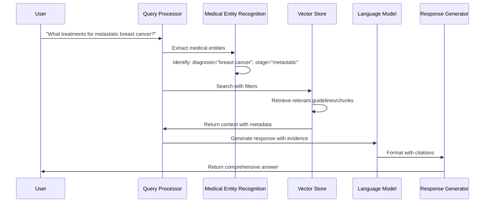

### **Evidence-Based Medical Retrieval**

```python
class EvidenceBasedRetrieval:
    def __init__(self):
        self.evidence_weights = {
            'ASCO': 1.0,
            'NCCN': 0.95,
            'EULAR': 0.90,
            'ESMO': 0.85
        }

        self.evidence_levels = {
            'Level A': 1.0,
            'Level B': 0.8,
            'Level C': 0.6
        }

    def rank_by_medical_authority(self, documents: List[Document]):
        """Rank documents by medical authority and evidence level"""

        ranked_docs = []
        for doc in documents:
            authority_score = self.evidence_weights.get(
                doc.metadata.get('institution', ''), 0.5
            )

            evidence_score = self.evidence_levels.get(
                doc.metadata.get('evidence_level', ''), 0.5
            )

            recency_score = self.calculate_recency_score(
                doc.metadata.get('last_updated')
            )

            # Weighted combination
            final_score = (
                authority_score * 0.4 +
                evidence_score * 0.4 +
                recency_score * 0.2
            )

            ranked_docs.append({
                'document': doc,
                'authority_score': authority_score,
                'evidence_score': evidence_score,
                'recency_score': recency_score,
                'final_score': final_score
            })

        return sorted(ranked_docs, key=lambda x: x['final_score'], reverse=True)

    def calculate_recency_score(self, last_updated: str):
        """Calculate recency score (medical knowledge changes rapidly)"""
        if not last_updated:
            return 0.5

        age_months = (datetime.now() - datetime.fromisoformat(last_updated)).days / 30

        # Prefer documents updated within 24 months
        if age_months <= 24:
            return 1.0 - (age_months / 24) * 0.2  # Gradual decay
        else:
            return max(0.3, 1.0 - (age_months / 12) * 0.1)  # Slower decay for older docs
```

### **LLM Integration Points**

#### **1. Treatment Guidelines Enhancement**
- **Query Type**: "What are the first-line treatments for Stage III lung cancer?"
- **Models Used**: GPT-4 + ClinicalBERT
- **Process**: Retrieve NCCN/ASCO guidelines → Generate comprehensive treatment plan
- **Output**: Evidence-based recommendations with citations

#### **2. Clinical Trial Matching Intelligence**
- **Query Type**: "Find trials for my breast cancer profile"
- **Models Used**: ClinicalBERT + Custom matching model
- **Process**: Extract patient profile → Semantic search trials → Score eligibility
- **Output**: Ranked trials with eligibility explanations

#### **3. Medication Safety Analysis**
- **Query Type**: "Check interactions for my medications"
- **Models Used**: BioBERT + Drug interaction model
- **Process**: Analyze drug combinations → Cross-reference databases → Risk assessment
- **Output**: Interaction warnings with management recommendations

#### **4. Patient Assistance Intelligence**
- **Query Type**: "What financial assistance is available?"
- **Models Used**: GPT-3.5-Turbo + Entity recognition
- **Process**: Match patient profile → Search assistance programs → Generate applications
- **Output**: Personalized assistance recommendations

### **Performance Optimization Architecture**

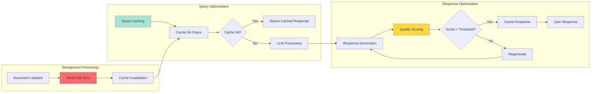

### **AI Integration with Existing Features**

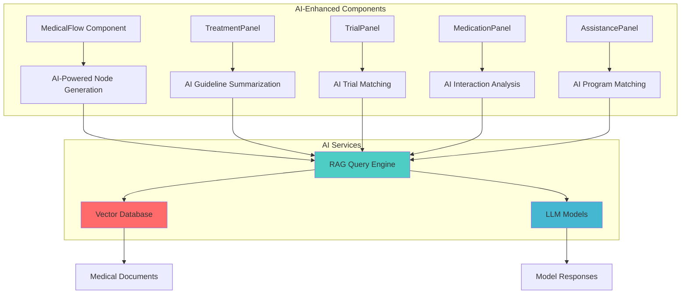

### **Implementation Architecture**

```python
# Core AI Services Architecture
class MedicalAIServices:
    def __init__(self):
        self.vector_store = self.initialize_vector_store()
        self.llm_models = self.initialize_llm_models()
        self.rag_pipeline = self.initialize_rag_pipeline()

    async def process_medical_query(self, query: str, context: dict):
        """Main entry point for medical AI queries"""

        # 1. Query understanding and entity extraction
        medical_context = await self.extract_medical_context(query)

        # 2. Retrieve relevant medical knowledge
        relevant_docs = await self.rag_pipeline.retrieve(
            query=query,
            filters=medical_context,
            top_k=5
        )

        # 3. Route to appropriate LLM model
        selected_model = self.model_router.route_query(query, relevant_docs)

        # 4. Generate AI response with medical validation
        response = await selected_model.generate_response(
            query=query,
            context=relevant_docs,
            medical_constraints=True
        )

        # 5. Add citations and evidence tracking
        cited_response = self.add_medical_citations(response, relevant_docs)

        return cited_response

    def add_medical_citations(self, response: str, source_docs: List[Document]):
        """Add medical evidence citations to AI responses"""
        citations = []

        for doc in source_docs:
            citation = {
                'source': doc.metadata.get('source_url', ''),
                'institution': doc.metadata.get('institution', ''),
                'evidence_level': doc.metadata.get('evidence_level', ''),
                'last_updated': doc.metadata.get('last_updated', '')
            }
            citations.append(citation)

        return {
            'response': response,
            'citations': citations,
            'evidence_score': self.calculate_evidence_score(citations)
        }
```

### **Model Performance Metrics**

```python
class AIModelMetrics:
    def track_performance(self):
        return {
            'response_time': self.measure_response_time(),
            'accuracy_score': self.evaluate_medical_accuracy(),
            'relevance_score': self.evaluate_clinical_relevance(),
            'citation_quality': self.evaluate_citation_completeness()
        }

    def evaluate_medical_accuracy(self, response: str, ground_truth: str):
        """Medical accuracy evaluation using clinical experts or validation datasets"""
        # Implementation would use medical validation frameworks
        pass

    def evaluate_clinical_relevance(self, response: str, patient_context: dict):
        """Clinical relevance scoring based on patient profile matching"""
        relevance_factors = {
            'diagnosis_match': self.check_diagnosis_relevance(response, patient_context),
            'stage_appropriateness': self.check_stage_relevance(response, patient_context),
            'treatment_feasibility': self.check_treatment_feasibility(response, patient_context)
        }

        return sum(relevance_factors.values()) / len(relevance_factors)
```

### **Security & Compliance for AI**

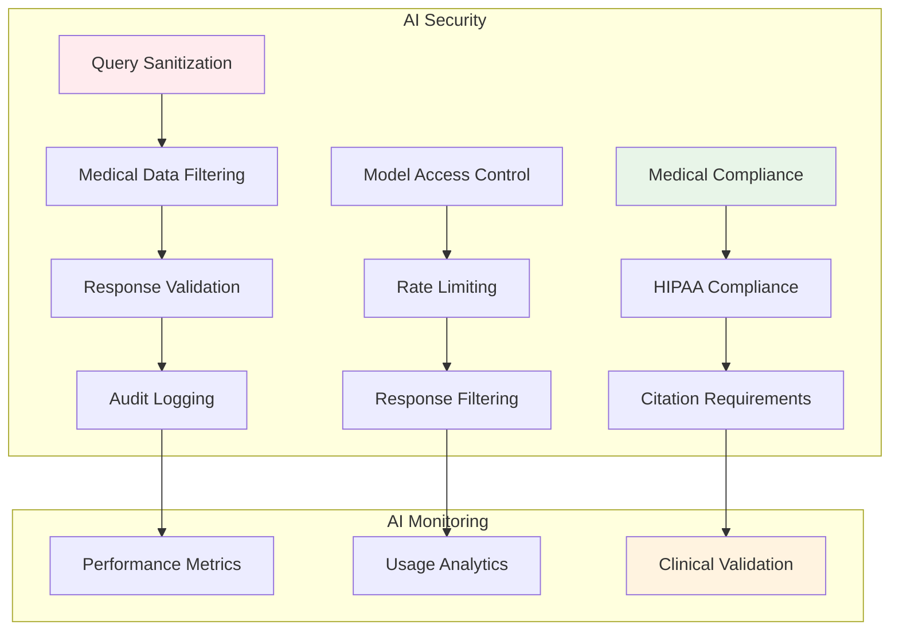

This comprehensive AI/ML architecture provides the foundation for intelligent medical guidance, evidence-based recommendations, and personalized healthcare navigation while maintaining the highest standards of medical accuracy and patient safety.

---

## Technical Specifications

### Frontend Stack
- **Framework**: React 18 with TypeScript
- **Visualization**: React Flow for medical pathway mapping
- **Styling**: Tailwind CSS with custom medical UI components
- **State Management**: Zustand for medical data management
- **Authentication**: Supabase Auth integration

### Backend Stack
- **Database**: PostgreSQL via Supabase
- **Authentication**: Supabase Auth with RLS
- **Real-time**: Supabase real-time subscriptions
- **APIs**: RESTful APIs with external integrations

### External Integrations
- **Clinical Trials**: ClinicalTrials.gov API integration
- **Medical Guidelines**: ASCO, EULAR, NCCN, ESMO data sources
- **Pharmacy Data**: Drug interaction and medication databases
- **Insurance**: Provider integration for assistance programs

### Security & Compliance
- **Authentication**: Secure user authentication with Supabase
- **Authorization**: Row Level Security (RLS) implementation
- **Data Protection**: HIPAA-compliant data handling
- **Audit Trail**: Comprehensive logging and monitoring

This architecture ensures a scalable, secure, and maintainable platform for medical treatment navigation while providing an intuitive user experience for patients and healthcare providers.
