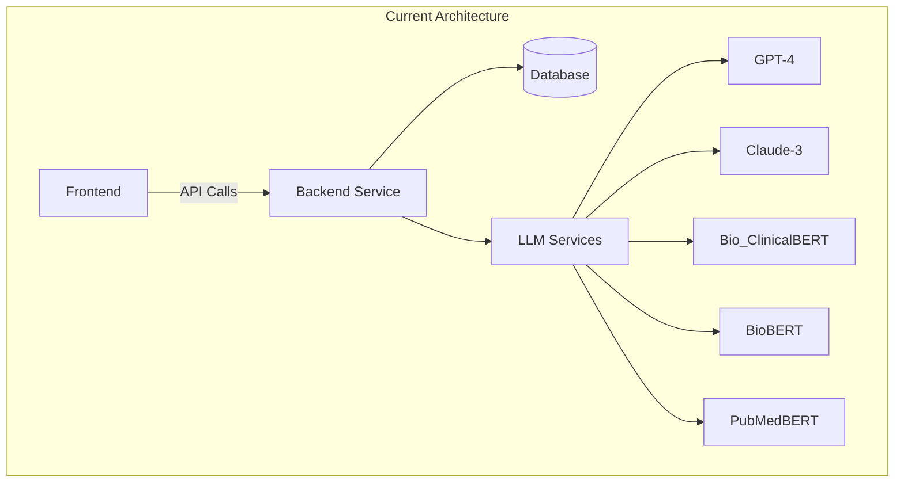
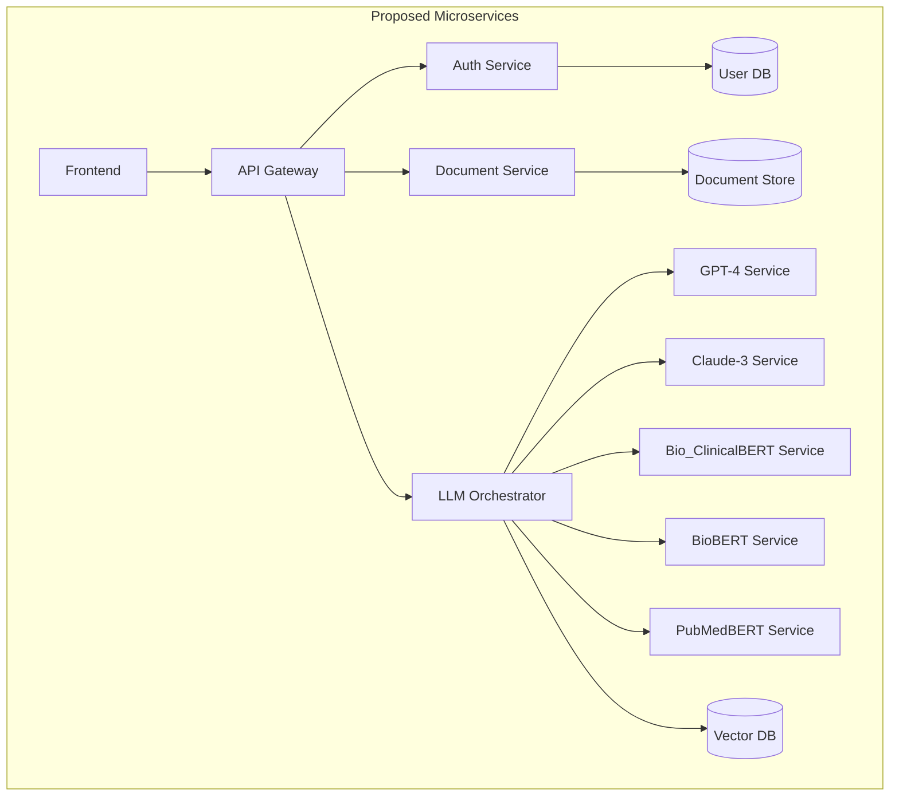

# Ayuma - Modularization and Docker Architecture

## Current Architecture



## Proposed Microservices Architecture



## Service Boundaries

### 1. Frontend Service
- React/TypeScript application
- UI/UX components
- API communication layer

### 2. API Gateway
- Request routing
- Authentication/Authorization
- Rate limiting
- Request/Response transformation

### 3. Auth Service
- User authentication
- JWT token management
- Role-based access control

### 4. Document Service
- Document processing pipeline
- Storage management
- Metadata extraction
- Caching layer

### 5. LLM Orchestrator
- Model selection and routing
- Response aggregation
- Fallback mechanisms
- Load balancing

### 6. LLM Services (Individual)
- Model-specific endpoints
- Prompt engineering
- Response formatting
- Performance monitoring

## Monitoring Implementation

### Metrics to Track
1. **API Gateway**
   - Request rate, latency, error rates
   - Authentication success/failure rates

2. **Document Service**
   - Processing time
   - Storage usage
   - Cache hit/miss ratios

3. **LLM Services**
   - Response times per model
   - Token usage
   - Error rates
   - Rate limiting metrics

### Tools
- **Prometheus** for metrics collection
- **Grafana** for visualization
- **OpenTelemetry** for distributed tracing
- **ELK Stack** for logging

## Migration Plan

### Phase 1: Preparation (2-3 weeks)
1. **Documentation**
   - API contracts
   - Database schemas
   - Authentication flows

2. **Monitoring**
   - Implement basic metrics
   - Set up dashboards
   - Define SLOs/SLAs

3. **Containerization**
   - Ensure all services are containerized
   - Set up local development with Docker Compose

### Phase 2: Extract Auth Service (3-4 weeks)
1. **Create Auth Service**
   - User management
   - Authentication/Authorization
   - JWT token handling

2. **Update API Gateway**
   - Route auth requests to new service
   - Implement service discovery

### Phase 3: Extract Document Service (4-5 weeks)
1. **Create Document Service**
   - Document processing
   - Storage management
   - Caching layer

2. **Data Migration**
   - Move document storage
   - Update references

### Phase 4: LLM Services (6-8 weeks)
1. **Create LLM Orchestrator**
   - Model selection
   - Load balancing
   - Fallback mechanisms

2. **Extract Individual LLM Services**
   - One service per model
   - Standardized interfaces
   - Health checks

## Risk Mitigation

1. **Database Transactions**
   - Implement distributed transactions
   - Consider eventual consistency

2. **Service Discovery**
   - Use Consul or similar
   - Implement health checks

3. **Error Handling**
   - Circuit breakers
   - Retry policies
   - Fallback mechanisms

## Development Environment Setup

### Docker Compose for Development

```yaml
version: '3.8'
services:
  frontend:
    build:
      context: ./frontend
      dockerfile: Dockerfile.dev
    ports:
      - "3000:3000"
    volumes:
      - ./frontend/src:/app/src
      - ./frontend/public:/app/public
    environment:
      - NODE_ENV=development

  api-gateway:
    build: 
      context: ./api-gateway
      dockerfile: Dockerfile.dev
    ports:
      - "8000:8000"
    depends_on:
      - auth-service
      - document-service
      - llm-orchestrator

  auth-service:
    build: ./auth-service
    ports:
      - "8001:8000"

  document-service:
    build: ./document-service
    ports:
      - "8002:8000"

  llm-orchestrator:
    build: ./llm-orchestrator
    ports:
      - "8003:8000"

  prometheus:
    image: prom/prometheus
    ports:
      - "9090:9090"
    volumes:
      - ./monitoring/prometheus.yml:/etc/prometheus/prometheus.yml

  grafana:
    image: grafana/grafana
    ports:
      - "3001:3000"
```

## Next Steps

1. **Review and Prioritize**
   - Which service to extract first?
   - What are the biggest pain points?

2. **Set Up Monitoring**
   - Start collecting metrics
   - Establish baselines

3. **Create Detailed Technical Specs**
   - API contracts
   - Data flow diagrams
   - Deployment architecture

## Appendix: Development Commands

```bash
# Start all services
docker-compose -f docker-compose.dev.yml up -d

# View logs
docker-compose logs -f

# Run tests
docker-compose run --rm frontend npm test
docker-compose run --rm api-gateway pytest
```

## Version History

- **2025-11-06**: Initial architecture document created
