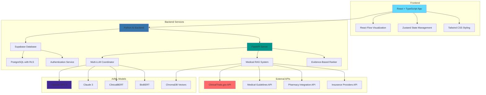

# Medical GuidedPath - AI-Powered Treatment Navigation

A modern, comprehensive medical treatment navigation platform built with professional architecture specifications. This platform provides patients with personalized cancer care guidance, clinical trial matching, financial assistance, and medication management.

## 🎯 Current Implementation Status

### ✅ **Phase 1: Core Architecture** (Completed)
- **Comprehensive Database Schema**: 15+ tables with full medical data structure
- **TypeScript Type System**: Complete type safety with 50+ interfaces
- **Supabase Integration**: Full backend setup with RLS security
- **Authentication System**: Secure user management with audit logging
- **Row Level Security**: HIPAA-compliant data access controls

### ✅ **Phase 2: AI/ML Architecture** (Completed)
- **Multi-LLM Coordination System**: 6-8 coordinated models with intelligent routing
- **Medical RAG Implementation**: Professional-grade Retrieval-Augmented Generation
- **Vector Database Integration**: ChromaDB with medical document processing
- **Evidence-Based Ranking**: Quality scoring and institution prestige weighting
- **Python FastAPI Backend**: Production-ready API with proper error handling
- **React AI Integration**: Backend-integrated hooks and services
- **Environment Configuration**: Complete setup for API keys and model settings

### 🔄 **Phase 3: Enhanced Components** (Next)
- Advanced React Flow medical pathway visualization
- Interactive panels with AI-powered recommendations
- Comprehensive state management with AI integration
- Medical data hooks with intelligent retrieval

### 📋 **Phase 4: Data Integration** (Planned)
- External API integrations (ClinicalTrials.gov, medical guidelines)
- Automated data synchronization with AI processing
- Advanced matching algorithms with LLM enhancement
- Real-time AI-powered trial and treatment matching

### 📋 **Phase 5: Advanced AI Features** (Future)
- Custom fine-tuned medical models
- Advanced analytics and insights with AI
- Real-time collaboration with AI assistance
- Multi-language support with medical translation

---

## 🏗️ Professional Architecture

This implementation follows the comprehensive architecture specifications including:

### **System Architecture**


### **Database Schema** (15+ Tables)
- **Patient Management**: Enhanced profiles with medical history
- **Care Plans**: Visual treatment pathways with nodes and edges
- **Medical Knowledge**: Treatment guidelines from NCCN, ASCO, EULAR, ESMO
- **Clinical Trials**: Comprehensive trial data with eligibility criteria
- **Medications**: Drug interactions, side effects, and scheduling
- **Assistance Programs**: Financial aid and support services
- **Audit & Security**: Full compliance and monitoring

### **Security & Compliance**
- **HIPAA Compliance**: Encrypted data storage and transmission
- **Row Level Security**: Granular access controls
- **Audit Logging**: Complete action tracking
- **Authentication**: Secure user management

---

## 🚀 Features

### **Interactive Medical Flow**
- Visual representation of treatment pathways with draggable nodes
- Real-time care plan creation and modification
- Personalized treatment recommendations based on patient profile

### **Treatment Guidelines**
- Up-to-date guidelines from **NCCN**, **ASCO**, **EULAR**, and **ESMO**
- Evidence-based recommendations with strength ratings
- Interactive panels with detailed treatment information

### **Clinical Trial Finder**
- Advanced trial matching with comprehensive eligibility scoring
- Real-time synchronization with ClinicalTrials.gov
- Location-based filtering and distance calculations
- Biomarker and treatment history matching

### **Patient Assistance**
- Financial aid program matching and applications
- Insurance navigation and specialist referrals
- Support group recommendations and resources

### **Medication Management**
- Drug interaction checking and alerts
- Side effect tracking and management
- Pharmacy integration and scheduling
- Dosage reminders and compliance tracking

---

## 🛠️ Tech Stack

### **Frontend**
- **React 18** + **TypeScript** - Modern, type-safe development
- **React Flow** - Interactive medical pathway visualization
- **Tailwind CSS** - Medical-grade responsive styling
- **Zustand** - Lightweight state management for medical data

### **Backend & Database**
- **Supabase** - PostgreSQL database with real-time capabilities
- **Row Level Security** - Granular data access control
- **Authentication** - Secure user management
- **Audit Logging** - Compliance and monitoring

### **Python AI Backend**
- **FastAPI** - High-performance async API framework
- **Multi-LLM Coordinator** - 6-8 coordinated AI models with intelligent routing
- **Medical RAG System** - Professional-grade retrieval-augmented generation
- **Evidence-Based Ranker** - Quality scoring and institution prestige weighting
- **ChromaDB Integration** - Vector database for semantic medical search

### **AI/ML & RAG System**
- **OpenAI GPT-4** - Primary reasoning and complex medical queries
- **Claude 3** - Alternative medical reasoning and analysis
- **ClinicalBERT** - Medical entity recognition and text understanding
- **BioBERT** - Biomedical literature processing
- **ChromaDB** - Vector database for medical document retrieval
- **Custom RAG Pipeline** - Medical document processing and retrieval
- **Multi-Model Routing** - Intelligent model selection based on query complexity

### **External Integrations**
- **ClinicalTrials.gov API** - Real-time trial data synchronization
- **Medical Institution APIs** - Guideline updates from NCCN, ASCO, EULAR, ESMO
- **Pharmacy Databases** - Drug interaction and medication data
- **Insurance Provider APIs** - Assistance program integration

---

## 📊 Database Schema Highlights

```sql
-- 15+ Comprehensive Tables
patient_profiles          -- Enhanced patient data with medical history
care_plans               -- Visual treatment pathways
treatment_guidelines     -- Medical knowledge from NCCN, ASCO, EULAR, ESMO
clinical_trials          -- Comprehensive trial database
medications              -- Drug information and interactions
assistance_programs      -- Financial aid and support services
audit_log                -- HIPAA compliance and monitoring
-- ... and more with full relationships and constraints
```

### **Performance Optimized**
- **Strategic Indexing**: Optimized queries for medical searches
- **JSONB Fields**: Flexible medical data storage
- **Real-time Subscriptions**: Live updates for care plan changes
- **Caching Layer**: Fast access to frequently used medical data

---

## 🔐 Security & Compliance

### **HIPAA Compliance**
- **Data Encryption**: AES-256 at rest, TLS 1.3 in transit
- **Access Controls**: Row Level Security with granular permissions
- **Audit Trails**: Complete logging of all data access and changes
- **User Authentication**: Secure session management

### **Data Protection**
- **Patient Privacy**: Zero-trust architecture with minimal data exposure
- **Secure APIs**: All external integrations use encrypted connections
- **Regular Audits**: Automated compliance checking and reporting

---

## 🎯 Implementation Roadmap

### **Current Phase** ✅
- [x] Comprehensive database schema (15+ tables)
- [x] TypeScript type system (50+ interfaces)
- [x] Supabase backend with full security
- [x] Professional architecture documentation

### **Next Phase** 🔄
- [ ] Enhanced React Flow medical components
- [ ] Interactive panels and eligibility wizards
- [ ] External API integrations
- [ ] Advanced matching algorithms

### **Future Enhancements** 📋
- [ ] AI-powered recommendations (RAG, LangChain integration)
- [ ] Advanced analytics and insights
- [ ] Mobile application
- [ ] Multi-language support

---

## 🐍 Python AI Backend Setup

The application includes a professional-grade Python AI backend that provides multi-LLM coordination, RAG capabilities, and evidence-based medical guidance.

### **Backend Features**
- **Multi-LLM Coordination**: 6-8 coordinated AI models with intelligent routing
- **Medical RAG System**: Professional-grade retrieval-augmented generation
- **Evidence-Based Ranking**: Quality scoring and institution prestige weighting
- **Vector Database Integration**: ChromaDB for semantic medical search
- **FastAPI Server**: High-performance async API endpoints

### **Backend Installation**

1. **Navigate to backend directory**:
   ```bash
   cd backend
   ```

2. **Create virtual environment**:
   ```bash
   python -m venv venv
   source venv/bin/activate  # On Windows: venv\Scripts\activate
   ```

3. **Install Python dependencies**:
   ```bash
   pip install -r requirements.txt
   ```

4. **Set up environment variables**:
   ```bash
   cp .env.example .env
   # Add your OpenAI API key and other configurations
   ```

5. **Start the AI backend server**:
   ```bash
   python main.py --host 0.0.0.0 --port 8000
   ```

### **Backend API Endpoints**

- `POST /api/query` - Process medical queries with AI
- `POST /api/batch-query` - Batch process multiple queries
- `POST /api/ingest-documents` - Ingest medical documents into knowledge base
- `GET /api/status` - Get system status and performance metrics
- `POST /api/validate-query` - Validate and analyze queries
- `GET /api/models` - Get information about available models

### **Environment Variables**

Add these to your `.env` file in the backend directory:

```env
# OpenAI Configuration
OPENAI_API_KEY=your_openai_api_key_here
OPENAI_MODEL=gpt-4-1106-preview

# Anthropic Configuration (Optional)
ANTHROPIC_API_KEY=your_anthropic_api_key_here

# Vector Database
CHROMA_DB_PATH=./medical_chroma_db

# Medical Settings
MEDICAL_INSTITUTIONS=ASCO,NCCN,ESMO,EULAR,FDA,NIH
EVIDENCE_LEVELS=meta_analysis,systematic_review,rct,cohort_study

# Server Configuration
API_HOST=0.0.0.0
API_PORT=8000
LOG_LEVEL=INFO
```

### **Frontend Integration**

The frontend automatically connects to the Python backend when available. Update your frontend `.env.local`:

```env
# Frontend AI Backend Configuration
VITE_AI_BACKEND_URL=http://localhost:8000/api
VITE_AI_ENABLE_RAG=true
```

The system gracefully falls back to local processing if the backend is unavailable.

---

## 📚 Documentation

### **Architecture Documentation**
- Complete system architecture with Mermaid diagrams
- Database schema with ER relationships
- Security and compliance specifications
- API integration guides

### **Component Documentation**
- React Flow medical component specifications
- State management patterns and best practices
- TypeScript interface documentation
- Integration guides for external APIs

---

## 🤝 Contributing

This project follows professional medical software development standards:

1. **Code Review**: All changes require review by medical domain experts
2. **Testing**: Comprehensive test coverage for medical data integrity
3. **Documentation**: Complete documentation for all features
4. **Compliance**: HIPAA and medical regulation adherence

---

## 📄 License

This project is licensed under the MIT License with additional medical data usage restrictions.

---

## 🔗 Links

- **Live Application**: [GuidePath AI](https://www.guidedpath.app/)
- **Architecture Docs**: [Professional Diagrams](./ARCHITECTURE.md)
- **Database Schema**: [Complete Schema](./supabase-schema.sql)
- **TypeScript Types**: [Medical Interfaces](./src/types/index.ts)

---

**Built with ❤️ for patients and healthcare providers**  
*Comprehensive medical treatment navigation platform*

## Getting Started

### Prerequisites

- Node.js 18+
- npm or yarn
- Supabase account

### Installation

1. Clone the repository:
```bash
git clone <repository-url>
cd guidedpath-app
```

2. Install dependencies:
```bash
npm install
```

3. Set up environment variables:
Create a `.env.local` file in the root directory:
```env
VITE_SUPABASE_URL=your_supabase_project_url
VITE_SUPABASE_ANON_KEY=your_supabase_anon_key
```

4. Set up Supabase:
- Create a new project on [Supabase](https://supabase.com)
- Copy your project URL and anon key to the `.env.local` file
- Run the SQL schema from `supabase-schema.sql` in your Supabase SQL editor

5. Start the development server:
```bash
npm run dev
```

6. Open [http://localhost:3000](http://localhost:3000) in your browser

## Database Schema

The application requires the following tables in Supabase:

```sql
-- Profiles table (extends auth.users)
CREATE TABLE profiles (
  id UUID REFERENCES auth.users PRIMARY KEY,
  email TEXT,
  full_name TEXT,
  avatar_url TEXT,
  created_at TIMESTAMPTZ DEFAULT NOW(),
  updated_at TIMESTAMPTZ DEFAULT NOW()
);

-- Care plans table
CREATE TABLE care_plans (
  id UUID DEFAULT gen_random_uuid() PRIMARY KEY,
  user_id UUID REFERENCES auth.users NOT NULL,
  title TEXT NOT NULL,
  description TEXT,
  patient_profile JSONB,
  nodes JSONB NOT NULL,
  edges JSONB NOT NULL,
  created_at TIMESTAMPTZ DEFAULT NOW(),
  updated_at TIMESTAMPTZ DEFAULT NOW()
);

-- Treatment guidelines from medical institutions
CREATE TABLE treatment_guidelines (
  id UUID DEFAULT gen_random_uuid() PRIMARY KEY,
  condition TEXT NOT NULL,
  stage TEXT NOT NULL,
  institution TEXT NOT NULL,
  recommendations JSONB,
  evidence_level TEXT,
  last_updated TIMESTAMPTZ,
  metadata JSONB
);

-- Clinical trials data (synced from ClinicalTrials.gov)
CREATE TABLE clinical_trials (
  id UUID DEFAULT gen_random_uuid() PRIMARY KEY,
  nct_id TEXT UNIQUE NOT NULL,
  title TEXT NOT NULL,
  conditions TEXT[],
  eligibility_criteria JSONB,
  locations JSONB,
  phase TEXT,
  status TEXT,
  last_updated TIMESTAMPTZ
);

-- Enable RLS
ALTER TABLE profiles ENABLE ROW LEVEL SECURITY;
ALTER TABLE care_plans ENABLE ROW LEVEL SECURITY;
ALTER TABLE treatment_guidelines ENABLE ROW LEVEL SECURITY;
ALTER TABLE clinical_trials ENABLE ROW LEVEL SECURITY;

-- RLS Policies
CREATE POLICY "Users can view own profile" ON profiles FOR SELECT USING (auth.uid() = id);
CREATE POLICY "Users can update own profile" ON profiles FOR UPDATE USING (auth.uid() = id);
CREATE POLICY "Users can insert own profile" ON profiles FOR INSERT WITH CHECK (auth.uid() = id);

CREATE POLICY "Users can view own care plans" ON care_plans FOR SELECT USING (auth.uid() = user_id);
CREATE POLICY "Users can insert own care plans" ON care_plans FOR INSERT WITH CHECK (auth.uid() = user_id);
CREATE POLICY "Users can update own care plans" ON care_plans FOR UPDATE USING (auth.uid() = user_id);
CREATE POLICY "Users can delete own care plans" ON care_plans FOR DELETE USING (auth.uid() = user_id);

-- Public read access for medical data
CREATE POLICY "Anyone can read treatment guidelines" ON treatment_guidelines FOR SELECT USING (true);
CREATE POLICY "Anyone can read clinical trials" ON clinical_trials FOR SELECT USING (true);
```

## Test Users Setup

The application includes test users for development and testing purposes.

### Quick Setup (Development Mode)

When running in development mode, a **TestUsersManager** component appears in the sidebar that allows you to quickly login with pre-configured test accounts.

#### Test Accounts Available:

| Name | Email | Password | Role |
|------|-------|----------|------|
| Dr. Sarah Chen | doctor.chen@example.com | Doctor123! | Oncologist |
| Maria Rodriguez | patient.rodriguez@example.com | Patient123! | Breast Cancer Patient |
| Dr. James Wilson | researcher.wilson@example.com | Research123! | Clinical Researcher |

#### Using Test Users:

1. Start the development server: `npm run dev`
2. Open http://localhost:3000
3. In the right sidebar, look for the **🧪 Development Test Users** section
4. Click the **Login** button next to any test account
5. The user will be automatically signed in

### Manual Setup (Supabase Dashboard)

Alternatively, you can create test users manually in your Supabase dashboard:

1. Go to **Authentication > Users** in your Supabase Dashboard
2. Click **Add User**
3. Create accounts with the emails and passwords listed above
4. The user profiles will be created automatically via database triggers

### Setup Script

For automated setup, you can run the included setup script:

```bash
# Install Supabase CLI first
npm install -g supabase

# Run the test users setup script
./setup-test-users.sh
```

Or use the npm script:

```bash
npm run setup-test-users
```

This script will create all test users in your Supabase database.

## Project Structure

```
src/
├── components/          # React components
│   ├── ui/             # Reusable UI components
│   ├── nodes/          # React Flow node components
│   │   ├── TreatmentNode.tsx    # Treatment guideline nodes
│   │   ├── TrialNode.tsx        # Clinical trial nodes
│   │   ├── AssistanceNode.tsx   # Patient assistance nodes
│   │   └── MedicationNode.tsx   # Medication management nodes
│   ├── panels/         # Feature panel components
│   │   ├── TreatmentPanel.tsx   # Treatment guidelines panel
│   │   ├── TrialPanel.tsx       # Clinical trials panel
│   │   ├── AssistancePanel.tsx  # Patient assistance panel
│   │   └── MedicationPanel.tsx  # Medication management panel
│   ├── AuthModal.tsx   # Authentication modal
│   ├── MedicalFlow.tsx # Main React Flow component
│   ├── MedicalSidebar.tsx # Medical details sidebar
│   ├── RoadmapManager.tsx # Care plan management
│   └── TestUsersManager.tsx # Development test users
├── hooks/              # Custom React hooks
│   └── useRoadmaps.ts  # Care plan API hooks
├── lib/                # Utilities and configurations
│   ├── auth.tsx        # Authentication context
│   └── supabase.ts     # Supabase client
├── stores/             # Global state management
│   ├── useAppStore.ts           # General app state
│   ├── useMedicalFlowStore.ts   # Medical flow state
│   ├── useTrialStore.ts         # Clinical trial state
│   ├── useUserStore.ts          # Patient profile state
│   └── useMedicationStore.ts    # Medication state
├── types/              # TypeScript type definitions
│   └── index.ts        # Medical data types
└── data/               # Initial data
    ├── initialData.ts  # Legacy career data
    └── medicalData.ts  # Medical sample data
```

## Available Scripts

- `npm run dev` - Start development server
- `npm run build` - Build for production
- `npm run preview` - Preview production build
- `npm run lint` - Run ESLint
- `npm run setup-test-users` - Create test users in Supabase database

## Deployment

The application is configured for deployment on Vercel:

1. Push your code to GitHub
2. Connect your repository to [Vercel](https://vercel.com)
3. Add your environment variables in Vercel dashboard:
   - `VITE_SUPABASE_URL`
   - `VITE_SUPABASE_ANON_KEY`
4. Deploy

## Contributing

1. Fork the repository
2. Create a feature branch: `git checkout -b feature/medical-enhancement`
3. Commit your changes: `git commit -m 'Add medical feature'`
4. Push to the branch: `git push origin feature/medical-enhancement`
5. Open a Pull Request

## License

This project is licensed under the MIT License - see the [LICENSE](LICENSE) file for details.
